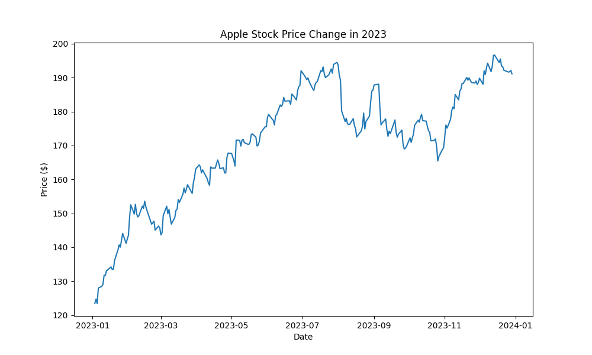

## ollama stock chart.ipynb

1. **Autogen フレームワークからコアクラスをインポート**

   ```python
   from autogen import AssistantAgent, UserProxyAgent
   ```

   * `AssistantAgent`：LLM（大規模言語モデル）との対話を担当
   * `UserProxyAgent`：コード実行を担当し、「ユーザー」として `AssistantAgent` にリクエストを送信

2. **LLM 接続情報の設定**

   ```python
   config_list = [
       {
           "model": "llama3",
           "base_url": "http://127.0.0.1:4000",
           "api_key": "ollama",
       }
   ]
   ```

   * ローカルの Ollama サーバー上の `llama3` モデルを使用
   * `base_url` と `api_key` で接続・認証情報を指定

3. **AssistantAgent のインスタンス化**

   ```python
   assistant = AssistantAgent(
       "assistant",
       llm_config={"config_list": config_list}
   )
   ```

   * 名前を `"assistant"` としたエージェントを作成し、上記の LLM 設定を適用

4. **UserProxyAgent のインスタンス化**

   ```python
   user_proxy = UserProxyAgent(
       "user_proxy",
       code_execution_config={
           "work_dir": "../result code plot",
           "use_docker": False
       }
   )
   ```

   * 名前を `"user_proxy"` としたエージェントを作成
   * `work_dir`：生成したファイル（例えばチャート画像）を保存するディレクトリ
   * `use_docker=False`：Docker を使わずホスト上で直接実行

5. **タスクパラメータの設定**

   ```python
   year = 2023
   company = "apple"
   ```

   * グラフ化対象の年度と企業名を指定

6. **プロットリクエストの送信**

   ```python
   user_proxy.initiate_chat(
       assistant,
       message=(
           f"Plot a chart of {company} stock price change in {year} "
           "and save in a file. Get information using yfinance."
       )
   )
   ```

   * `user_proxy` が `assistant` にメッセージを送り、以下を指示：

     1. `yfinance` で Apple の 2023 年の株価データを取得
     2. 価格変動の折れ線グラフを作成
     3. 指定ディレクトリにグラフを保存

     
     ※[yfinance](https://pypi.org/project/yfinance/)　market data from Yahoo! Finance's API

---

**まとめ**
「ユーザー代理（UserProxyAgent）＋アシスタント（AssistantAgent）」の対話を通じて、

1. データ取得コードの生成
2. グラフ作成コードの生成
3. 実行＆ファイル出力

### 実行結果：

AssistantAgent生成したpythonスクリプト：


最終的に生成したグラフ：

